# System Architecture

**LibreControl** adopts a modular architecture based on simplified microservices. Its goal is to decouple management logic (Team Server) from communication logic (Listeners and Redirectors).

> "The anatomy of a C2 is not just about control; it's about translating intent into action through hostile channels."

## High-Level Architecture Diagram

This diagram reflects the complete decoupling between management (Core) and network operation (Listeners).

```mermaid
flowchart TD
    %% Class Definitions for Styling
    classDef external stroke:#01579b,stroke-width:2px;
    classDef infra stroke:#e65100,stroke-width:2px;
    classDef broker stroke:#4a148c,stroke-width:2px,stroke-dasharray: 5 5;
    classDef target stroke:#b71c1c,stroke-width:2px;

    subgraph "Operator Environment"
        Operator["🧑‍💻 Operator"]:::external
        UI["🖥️ Command Interface<br>(Operational Console)"]:::external
    end

    subgraph "C2 Infrastructure<br>(Server-Side)"
        subgraph "Management & Persistence"
            API["⚙️ Management Core<br>(Orchestrator)"]:::infra
            DB[("🗄️ Cryptographic Ledger<br>(HMAC Chained Logs)")]:::infra
            Factory["🛠️ Build Subsystem<br>(Artifact Generation)"]:::infra
        end

        %% Decoupling Component
        Broker{{"⚡ Event Bus<br>(Message Broker)"}}:::broker
		
        subgraph "Edge Layer (Listeners)"
            L_Web["👂 Web Listener<br>(HTTP/S Traffic)"]:::infra
            L_Name["👂 Name Listener<br>(DNS Traffic)"]:::infra
            L_File["👂 File Listener<br>(SMB Traffic)"]:::infra
        end
    end

    subgraph "Target Environment<br>(Victim/Lab)"
        Redir["🔀 Redirectors<br>(Reverse Proxy)"]:::target
        Agent["🤖 Remote Agent<br>(Implant)"]:::target
        Sensor["🛡️ Security Sensor<br>(EDR/SIEM)"]:::target
    end

    %% --- RELATIONSHIPS ---

    %% Control Flow
    Operator -->|Secure Channel| UI
    UI -->|"Internal API"| API
    API <--> DB
    
    %% Integration via Bus (Pub/Sub)
    API <==>|"Commands & Auditing"| Broker
    Factory <==>|"Build Requests"| Broker
    
    Broker <==>|"Task Queue"| L_Web
    Broker <==>|"Task Queue"| L_Name
    Broker <==>|"Task Queue"| L_File

    %% External Communication
    Agent <-->|"C2 Channel (ECDHE)"| Redir
    Redir <-->|"Forwarding"| L_Web
    
    %% Telemetry
    Agent -.->|"Behavior"| Sensor
    L_Web -.->|"Traffic Logs"| Broker
```

Resilience in distributed systems is based on the principle that failures in peripheral components should not compromise the integrity of the operational core. The proposed architecture mitigates risks through functional isolation.

## Architectural Components

> "The robustness of an offensive system lies in its ability to hide operational complexity behind simple interfaces, ensuring infrastructure survival even in hostile environments."

**LibreControl**'s architecture uses event-driven microservices to simulate resilience, stealth, and flexibility found in Advanced Persistent Threats (APTs). This section details the technical specifications and design rationale for each subsystem.

### Agent (Implant / Payload): Execution and Persistence Vector

The Agent is the software artifact deployed on the compromised endpoint. Unlike traditional remote administration tools (RATs), the C2 agent is designed for hostile environments, assuming constant monitoring by EDR solutions and security analysts.

#### Functional Responsibilities

- **Asynchronous Communication (Beaconing)**: Avoids persistent connections and uses intermittent polling.
- **Modular Command Execution**: Executes tasks in-memory or via the shell to reduce disk footprint and evade detection, allowing flexible execution of scripts, binaries, or custom routines without leaving artifacts.
- **Failover Mechanisms**: Uses multi-protocol fallback and dead-man switches to maintain resilience against listener disruptions, automatically switching channels and retrying connections to ensure continued operation.
- **Forward Secrecy**: Generates ephemeral keys for every session. Static keys are used **only** for authentication, ensuring that the compromise of the server does not decrypt historical traffic.
- **Replay Protection**: Implements a **Monotonic Counter** in the protocol header. The agent discards any task with an ID $\le$ the last executed task, neutralizing packet replay attacks.

### Listeners (Communication Interfaces)

Listeners decouple control logic (what to do) from the transport (how to deliver), masking traffic and sanitizing input.

#### Functional Responsibilities

- **Traffic Masking (Malleable Profiles)**: Mimics legitimate network traffic to evade detection.
- **Strict Deserialization**: Implements rigid schema validation (Protobuf) to prevent "Hot Patching" or memory corruption attacks from malicious agents.
- **Stateless Forwarding**: Passes data to the Broker without maintaining agent context.
- **Failure Isolation:** Containerized listeners ensure edge vulnerabilities do not compromise the core.

### Message Broker (Orchestration)

Enables asynchronous, distributed, and scalable operations using technologies such as Redis or RabbitMQ, acting as the core hub for task distribution, service coordination, and event-driven orchestration across the system.

#### Functional Responsibilities

- **Queue Management**: Buffers tasks during service downtime, enforces prioritization, and ensures reliable delivery under high load conditions, preventing task loss and enabling smooth system operation during spikes or temporary outages.
- **Pub/Sub Pattern**: Facilitates loosely coupled, pluggable microservices that can subscribe to events, trigger workflows, and extend functionality without modifying core logic, supporting dynamic scaling and modular feature development.
- **Polyglot Interoperability**: Provides seamless integration for components developed in multiple programming languages, enabling cross-platform compatibility, flexible deployment, and easier collaboration between diverse development teams.

### Team Server Core

Serves as the central authority and sole "source of truth," secured within the trusted infrastructure zone, responsible for managing agent operations, cryptographic protocols, and task orchestration.

#### Functional Responsibilities

- **State & Session Management**: Continuously tracks agent status, operational metadata, and connectivity health, ensuring accurate session persistence and enabling responsive system monitoring.
- **Cryptographic Enforcement**: Manages ephemeral key exchanges, enforces forward secrecy, and validates HMAC signatures to guarantee message integrity and prevent tampering or replay attacks.
- **Tasking Logic**: Translates operator instructions into agent-specific opcodes, handles prioritization, and schedules execution to maintain reliable and flexible operational control across the environment.

### Database: Persistence, History, and Auditing

Provides secure storage for operational state, historical data, and comprehensive audit trails, enabling reliable tracking and post-incident analysis.

#### Functional Responsibilities

- **Tamper-Evident Logging**: Implements an **HMAC Chain** for the audit log, where each entry’s hash depends on the previous entry ($Hash_N = SHA256(Hash_{N-1} + Data)$). This design ensures that any modification, deletion, or insertion — even by a root user — breaks the cryptographic chain, providing verifiable integrity for all historical records.
- **Encrypted Storage**: All stored data, including agent state and audit logs, is encrypted at rest using strong symmetric cryptography, protecting sensitive operational information from unauthorized access.
- **Access Control & Segmentation**: Implements strict role-based access controls and database segmentation to minimize exposure, enforce least privilege, and prevent lateral movement in case of compromise.
- **Replication & Redundancy**: Supports real-time replication across multiple nodes or datacenters, ensuring high availability, fault tolerance, and data durability under network or hardware failures.
- **Query Auditing & Monitoring**: Logs all database queries and changes, allowing operators to detect unusual patterns, investigate incidents, and maintain compliance with security policies.

## Command Execution Pipeline

In asynchronous C2 architectures, execution is governed by agent beaconing latency. The following sequence illustrates the decoupled pipeline from operator command to agent execution.

