# Arquitetura do Sistema

O **LibreControl** adota uma arquitetura modular baseada em microsserviços simplificados. O objetivo é desacoplar a lógica de gestão (Team Server) da lógica de comunicação (Listeners), permitindo que estudantes analisem cada componente isoladamente.

> "A anatomia de um C2 não é apenas sobre controle; é sobre a tradução de intenção em ação através de canais hostis."

## Diagrama de Arquitetura de Alto Nível

Este diagrama reflete o desacoplamento total entre a gestão (Core) e a operação de rede (Listeners).

```mermaid
flowchart TD
    %% Definição de Classes para Estilo (Mantidas para consistência visual)
    classDef external stroke:#01579b,stroke-width:2px;
    classDef infra stroke:#e65100,stroke-width:2px;
    classDef broker stroke:#4a148c,stroke-width:2px,stroke-dasharray: 5 5;
    classDef target stroke:#b71c1c,stroke-width:2px;

    subgraph "Ambiente do Operador"
        Operator["🧑‍💻 Operador"]:::external
        UI["🖥️ Interface de Comando<br>(Console Operacional)"]:::external
    end

    subgraph "Infraestrutura C2<br>(Server-Side)"
        
        subgraph "Gestão & Persistência"
            API["⚙️ Núcleo de Gestão<br>(Orquestrador)"]:::infra
            DB[("🗄️ Repositório de Dados<br>(Estado e Logs)")]:::infra
            Factory["🛠️ Subsistema de Build<br>(Geração de Artefatos)"]:::infra
        end

        %% Componente de Desacoplamento
        Broker{{"⚡ Barramento de Eventos<br>(Message Broker)"}}:::broker

        subgraph "Camada de Borda (Listeners)"
            L_Web["👂 Listener Web<br>(Tráfego HTTP/S)"]:::infra
            L_Name["👂 Listener de Nomes<br>(Tráfego DNS)"]:::infra
            L_File["👂 Listener de Arquivos<br>(Tráfego SMB)"]:::infra
        end
    end

    subgraph "Ambiente Alvo<br>(Vítima/Laboratório)"
        Redir["🔀 Redirecionadores<br>(Proxy Reverso)"]:::target
        Agent["🤖 Agente Remoto<br>(Implante)"]:::target
        Sensor["🛡️ Sensor de Segurança<br>(EDR/SIEM)"]:::target
    end

    %% --- RELAÇÕES ---

    %% Fluxo de Controle
    Operator -->|Canal Seguro| UI
    UI -->|API Interna| API
    API <--> DB
    
    %% Integração via Barramento (Pub/Sub)
    API <==>|Comandos e Auditoria| Broker
    Factory <==>|Solicitações de Build| Broker
    
    Broker <==>|Fila de Tarefas| L_Web
    Broker <==>|Fila de Tarefas| L_Name
    Broker <==>|Fila de Tarefas| L_File

    %% Comunicação Externa
    Agent <-->|Canal C2| Redir
    Redir <-->|Encaminhamento| L_Web
    
    %% Telemetria
    Agent -.->|Comportamento| Sensor
    L_Web -.->|Logs de Tráfego| Broker
```

A resiliência em sistemas distribuídos fundamenta-se no princípio de que falhas em componentes periféricos não devem comprometer a integridade do núcleo operacional. A arquitetura aqui proposta mitiga riscos através do isolamento funcional.

## Componentes Arquiteturais

> "A robustez de um sistema ofensivo reside na sua capacidade de ocultar a complexidade operacional por trás de interfaces simples, garantindo a sobrevivência da infraestrutura mesmo em ambientes hostis."

A arquitetura do **LibreControl** transcende a simples execução de comandos remotos. Ela adota um paradigma de microsserviços orientados a eventos para simular a resiliência, a furtividade e a flexibilidade encontradas em Ameaças Persistentes Avançadas (APTs). Esta abordagem não apenas moderniza a infraestrutura de controle, mas também fornece aos estudantes um modelo realista de como organizações criminosas e estatais operam redes de botnets resilientes a takedowns. Esta seção expande as especificações técnicas e as justificativas de design para cada subsistema.

### Agente (Implant / Payload): Vetor de Execução e Persistência

O Agente é o artefato de software implantado no endpoint comprometido. Ao contrário de softwares tradicionais de administração remota (RATs) ou ferramentas de suporte de TI, o agente C2 é desenhado para operar em ambientes adversariais, assumindo que está sob constante monitoramento por soluções de EDR (Endpoint Detection and Response) e analistas de segurança.

#### Responsabilidades Funcionais

- **Comunicação Assíncrona (Beaconing):**

    - O agente evita manter conexões persistentes (como um socket TCP aberto ou Keep-Alive), pois conexões longas são anomalias facilmente detectáveis em redes corporativas.
    - Utiliza um modelo de _polling_ intermitente com **Jitter** (variação aleatória). Exemplo: "Conectar a cada 60 segundos, com +/- 20% de variação". Esta aleatoriedade é crítica para diluir a assinatura estocástica do tráfego, dificultando a detecção por análises heurísticas baseadas em frequência ou periodicidade (como a Análise de Transformada de Fourier).

- **Execução Modular de Comandos:**

    - **Shell Execution:** Execução direta via `cmd.exe`, PowerShell ou `/bin/bash`. Embora funcional, este método gera processos filhos (child processes) que são altamente monitorados e, portanto, possuem alta probabilidade de detecção.
    - **In-Memory Execution:** Capacidade avançada de carregar e executar código (assemblies .NET, DLLs, COFFs) diretamente no espaço de memória do processo do agente, sem jamais tocar no disco (_Fileless Malware_). Isso contorna varreduras de antivírus baseadas em arquivos e dificulta a coleta de evidências forenses tradicionais.

- **Mecanismos de Failover (Sobrevivência):**

    - O agente implementa uma lógica de "Dead Man's Switch". Ele possui uma lista priorizada de endereços de C2 e protocolos. Se o _Listener_ primário for bloqueado pelo firewall de borda ou derrubado por uma equipe de resposta a incidentes, o agente entra em modo de contingência, rotacionando automaticamente para o próximo endereço ou mudando o protocolo de transporte (ex: falha no canal HTTP -> tenta tunelamento via DNS TXT -> tenta canal SMB interno).

#### Justificativa do Desacoplamento

- **OpSec (Segurança Operacional):** O agente é projetado sob o princípio de "conhecimento zero". Ele contém apenas a chave pública do servidor para encriptação inicial. Se o binário for capturado, isolado em uma sandbox e sofrer engenharia reversa, o analista não conseguirá decifrar o tráfego histórico capturado na rede, nem terá capacidade matemática para assumir o controle do servidor C2, protegendo a integridade da operação global.
- **Evasão de Assinaturas:** Ao manter o núcleo do agente pequeno (stub) e modular, facilita-se o uso de _packers_, criptógrafos (crypters) e técnicas de ofuscação para evadir a detecção estática baseada em assinaturas (hashes MD5/SHA256).

### Listeners (Interfaces de Comunicação): Camada de Abstração e Tradução

Os Listeners funcionam como os tradutores poliglotas da arquitetura. Eles têm a função crítica de desacoplar a lógica de controle (O quê fazer) do meio de transporte (Como entregar). Projetados para serem componentes descartáveis, eles protegem o núcleo do sistema contra atribuição direta e ataques de retaliação.

#### Responsabilidades Funcionais

- **Mascaramento de Tráfego (Malleable Profiles):**

    - O Listener não apenas recebe dados; ele os disfarça ativamente para se misturar ao ruído de fundo da rede alvo. Através de perfis de maleabilidade, um Listener HTTP pode ser configurado para mimetizar o comportamento de um servidor web legítimo (como uma atualização do Windows Update ou tráfego de Amazon CloudFront).
    - Os dados de comando e controle podem ser esteganograficamente ocultados dentro de cookies de sessão, cabeçalhos HTTP customizados, ou anexados a metadados de imagens, transformando tráfego malicioso em requisições aparentemente benignas.

- **Normalização e Desserialização:**

    - O Listener atua como um sanitizador de entrada. Ele recebe o pacote bruto (bytes), remove a camada de transporte específica (ex: extrai o payload codificado em Base64 de uma resposta DNS TXT), e converte a mensagem para um formato estruturado universal (como JSON ou Protobuf) que o restante do sistema compreende. Isso permite que o núcleo processe lógica sem se preocupar se o dado veio via porta 80 ou porta 53.

- **Encaminhamento Stateless:**

    - Assim que o pacote é traduzido, é imediatamente despachado para o _Message Broker_. O Listener opera sem estado (stateless): não sabe "quem" é o agente, nem o histórico da operação; ele funciona apenas como um tubo de repasse eficiente e cego.

#### Resiliência Arquitetural

- **Isolamento de Falhas:** A arquitetura de contêineres garante que vulnerabilidades na borda não comprometam o sistema. Um erro de _buffer overflow_ na biblioteca de tratamento de pacotes do Listener DNS derrubará apenas aquele container específico. A operação via HTTP ou SMB permanecerá intacta e funcional, demonstrando o princípio de compartimentação de danos.

### Barramento de Mensagens (Message Broker): Sistema Nervoso Central (Orquestração)

Implementado sobre tecnologias robustas como Redis ou RabbitMQ, o Broker é o componente fundamental que permite que o sistema seja verdadeiramente assíncrono, distribuído e escalável. Ele rompe a dependência temporal rígida entre o Operador humano e o Agente remoto.

#### Responsabilidades Funcionais

- **Buffering e Gestão de Filas:**

    - Atua como um amortecedor de resiliência. Se o _Team Server Core_ precisar ser reiniciado para manutenção ou sofrer uma falha momentânea, os Agentes não perdem a conexão; eles continuam enviando dados para os Listeners, que os enfileiram seguramente no Broker. Assim que o Core retorna, ele processa o passivo acumulado sem perda de dados.
    - O sistema gerencia priorização de tráfego, distinguindo filas de alta prioridade (ex: comandos de "kill switch" ou auto-destruição) versus baixa prioridade (ex: exfiltração lenta de arquivos grandes em segundo plano).

- **Padrão Pub/Sub (Publicação/Assinatura):**

    - Habilita uma arquitetura plugável e extensível. Novos microsserviços podem ser acoplados ao barramento sem necessidade de refatoração do código existente. Por exemplo, um módulo de "Machine Learning para Detecção de Anomalias" poderia assinar o canal de tráfego para analisar padrões em tempo real, operando passivamente sem interferir no fluxo crítico de comando.

- **Interoperabilidade Poliglota:**

    - Remove barreiras de linguagem de programação. Permite, por exemplo, que o Core seja desenvolvido em Python (pela facilidade de manipulação de dados), enquanto um Listener de alta performance seja escrito em Rust ou Go, desde que ambos sigam o contrato de interface do Broker.

### Team Server Core (Núcleo de Gerenciamento): Inteligência e a Criptografia

O Core é a autoridade central e a única "fonte da verdade" da operação. Por design, ele deve residir na zona mais segura e restrita da infraestrutura, protegido por firewalls, VPNs e listas de controle de acesso (ACLs), nunca exposto diretamente à internet pública.

#### Responsabilidades Funcionais

- **Gestão de Estado e Sessão:**

    - Mantém a tabela de estado global dos implantes. O Core diferencia logicamente entre um novo "Beacon" (primeiro contato de um host infectado) e um check-in de rotina de um agente existente.
    - Monitora e atualiza metadados operacionais críticos: integridade do processo (se o agente migrou de PID), latência de rede, usuário logado e privilégios do sistema operacional.

- **Criptografia Assimétrica/Simétrica (Camada de Aplicação):**

    - O Core é o guardião da fronteira criptográfica. Enquanto o transporte pode usar TLS (HTTPS), o payload interno possui sua própria camada de encriptação (geralmente AES ou ChaCha20). O Core detém as chaves privadas (RSA/ECC) necessárias para decifrar a negociação inicial e estabelecer chaves de sessão efêmeras, garantindo que nem mesmo os Proxy/Listeners intermediários consigam ler o conteúdo dos comandos.

- **Lógica de Tasking:**

    - Traduz a intenção humana do operador (ex: "Quero listar os processos") no _OpCode_ binário específico que a versão do agente entende. O Core gerencia a complexidade de enfileirar essa tarefa para ser entregue apenas na próxima janela de conexão disponível do agente.

### Payload Factory (Subsistema de Geração): Fábrica de Artefatos Automatizada

Um microsserviço especializado, frequentemente isolado em seu próprio ambiente de execução, dedicado ao processo de _Cross-Compilation_ e geração de artefatos.

#### Responsabilidades Funcionais

- **Pipeline de Build Dinâmico:**

    - O sistema evita o armazenamento de binários estáticos pré-compilados. Cada agente é gerado sob demanda (_Just-in-Time Compilation_), permitindo que configurações vitais (Endereço IP do C2, Chave Pública, Jitter, Data de Expiração) sejam "cozidas" diretamente no código-fonte antes da compilação, eliminando a necessidade de arquivos de configuração externos que poderiam ser descobertos.

- **Ofuscação Automatizada:**

    - Integra ferramentas de ofuscação no pipeline para aplicar polimorfismo simples. A cada compilação, o código pode sofrer alterações na estrutura (renomeação de variáveis, inserção de código lixo) para alterar a assinatura final do arquivo. Isso frustra a detecção baseada em hash (MD5/SHA256), garantindo que um payload detectado em uma máquina não "queime" os payloads em outras máquinas.

- **Isolamento de Recursos:**

    - O processo de compilação é intensivo em CPU e I/O. Isolar a Fábrica em um container separado impede que um pico de solicitações de geração de agentes cause lentidão na API ou na interface de comando dos operadores ativos.

### Banco de Dados (Database): Persistência, Histórico e Auditoria

O repositório persistente (SQL relacional ou NoSQL) serve como a memória de longo prazo da operação, essencial tanto para a continuidade da campanha ofensiva quanto para a análise defensiva pós-exercício.

#### Responsabilidades Funcionais

- **Rastreabilidade Total (Audit Trail):**

    - Implementa um log imutável onde cada comando emitido, cada erro de sistema e cada byte retornado é registrado com _timestamp_ de alta precisão. 
    - Em exercícios de Red Teaming, isso é vital para o processo de "Deconfliction": a capacidade de provar matematicamente que uma atividade suspeita na rede foi originada pelo exercício autorizado e não por um ator malicioso real coincidente.

- **Replay Operacional:**

    - A estrutura de dados permite que instrutores ou analistas realizem o "replay" da operação. É possível reconstruir a linha do tempo do ataque passo a passo para fins didáticos, entendendo a cronologia exata do compromisso, da entrada inicial até a exfiltração de dados.

- **Estrutura de Dados Relacional:**

    - Mantém relacionamentos complexos entre entidades: Agentes -> Hosts -> Comandos -> Resultados. Isso permite consultas analíticas profundas, como "Listar todos os hosts que executaram o comando `whoami` e retornaram privilégio `SYSTEM` nas últimas 24 horas".

### Frontend/Console: Interface de Comando e Controle

O "painel de vidro" (single pane of glass) através do qual os operadores humanos interagem com a complexidade subjacente da infraestrutura distribuída.

#### Responsabilidades Funcionais

- **Operação Multi-Usuário (Multiplayer):**

    - Suporta colaboração em tempo real, permitindo que múltiplos operadores (Red Team) trabalhem na mesma sessão. Um operador pode visualizar instantaneamente os comandos enfileirados e os resultados obtidos por outro colega via WebSockets, facilitando a coordenação tática.

- **Visualização de Dados e Topologia:**

    - Transforma logs textuais brutos em representações visuais intuitivas, como grafos de rede que demonstram relações de pivoteamento (ex: Agente A controlando Agente B via SMB) e tabelas de processos interativas que facilitam a identificação de alvos para injeção.

- **Segurança de Acesso (RBAC):**

    - Implementa um modelo robusto de Controle de Acesso Baseado em Função. Isso permite segregar permissões granulares: um usuário "Estudante" pode ter permissão apenas para visualizar a telemetria da operação (Read-Only), enquanto um "Instrutor" possui privilégios elevados para executar comandos sensíveis, derrubar agentes ou limpar rastros.

## Fluxo de Execução de Comandos (Pipeline de Dados)

Em arquiteturas assíncronas de Comando e Controle (C2), a execução não é imediata. O tempo entre a ordem e a ação é governado pela latência do _beaconing_, exigindo um pipeline de dados robusto que garanta a integridade da instrução através do tempo e do espaço.

O diagrama abaixo ilustra o pipeline de dados descrito na documentação, demonstrando o desacoplamento entre a emissão do comando (Operador) e a sua recepção (Agente).

```mermaid
sequenceDiagram
    autonumber
    
    box "Ambiente de Controle" #f9f9f9
        actor Op as 🧑‍💻 Operador
        participant UI as 🖥️ Frontend
        participant Core as 🧠 Team Server
        participant DB as 🗄️ Database
        participant Broker as ⚡ Message Broker
    end
    
    box "Perímetro de Rede (Borda)" #e1f5fe
        participant List as 👂 Listener (HTTP)
    end
    
    box "Alvo Comprometido" #ffebee
        participant Agent as 🤖 Agente
    end

    %% FASE 1: TASKING
    Note over Op, Broker: 1. FASE DE EMISSÃO (TASKING)
    Op->>UI: Input: "shell whoami"
    UI->>Core: API Request (Queue Task)
    activate Core
    Core->>DB: Persiste Tarefa (Status: Pending)
    Core->>Broker: Publica Tarefa (Topic: agent_id)
    deactivate Core
    
    %% FASE 2: BEACONING & DELIVERY
    Note over Broker, Agent: 2. FASE DE ENTREGA (ASSÍNCRONA)
    
    %% Loop de espera (Jitter)
    Note right of Agent: Agente dorme... (Jitter)
    
    Agent->>List: Check-in (GET /login)
    activate List
    List->>Broker: Consulta tarefas pendentes?
    Broker-->>List: Retorna JSON da tarefa (Cifrado)
    List-->>Agent: HTTP Response (Payload da Tarefa)
    deactivate List

    %% FASE 3: EXECUÇÃO
    Note over Agent: 3. EXECUÇÃO LOCAL
    Agent->>Agent: Descriptografa & Executa
    Note right of Agent: Output: "nt authority\system"

    %% FASE 4: REPORTING
    Note over Agent, Op: 4. FASE DE RETORNO (REPORTING)
    Agent->>List: Envia Resultado (POST /submit)
    activate List
    List->>Broker: Publica Resultado (Topic: results)
    List-->>Agent: HTTP 200 OK (Ack)
    deactivate List
    
    Broker-->>Core: Consome Resultado
    activate Core
    Core->>DB: Atualiza Tarefa (Status: Complete)
    Core->>UI: WebSocket Push (Update View)
    deactivate Core
    
    UI-->>Op: Exibe Output no Terminal
```

O fluxo de dados no **LibreControl** é projetado para garantir a **confidencialidade** (via criptografia ponta-a-ponta) e a **disponibilidade** (via filas persistentes). Abaixo, detalhamos a anatomia de uma interação completa.

### Fase 1: Emissão e Enfileiramento (Tasking Phase)

Nesta fase, a intenção humana é traduzida em uma estrutura de dados pendente. O Agente remoto ainda não tem conhecimento desta ação.

#### 1. Submissão do Operador

O Operador interage com a Interface de Controle (Frontend) para emitir um comando, por exemplo: `shell whoami`.

- **Validação de Input:** O Frontend realiza uma sanitização preliminar para evitar erros de sintaxe óbvios.
- **Construção do Objeto:** A interface encapsula o comando em um objeto JSON contendo o ID do Agente alvo e os parâmetros da tarefa.

#### 2. Transmissão para o Núcleo (Team Server)

A Interface transmite a solicitação para a API REST/GraphQL do Team Server via um canal HTTPS seguro e autenticado (JWT/OAuth).

- **Verificação de Sessão:** O Team Server valida se o operador possui as permissões (RBAC) necessárias para interagir com aquele agente específico.

#### 3. Processamento e Criptografia (O Ponto Crítico)

O Team Server não envia o texto `shell whoami` diretamente.

- **Criptografia de Aplicação:** O Núcleo recupera a chave de sessão simétrica (AES-256 ou Chacha20) negociada exclusivamente com aquele agente. O comando é cifrado _antes_ de deixar o núcleo.
- **Publicação no Broker:** O comando cifrado (blob binário) é envelopado em metadados de roteamento e publicado no **Barramento de Mensagens** (ex: fila `tasks:agent_id_123`).
    - **Nota Técnica**: Neste momento, o comando está "em repouso" na memória do Broker. Se o Agente demorar 3 horas para conectar, o comando aguardará pacientemente na fila.

### Fase 2: Entrega Assíncrona (Delivery Phase)

A entrega depende inteiramente da iniciativa do Agente. O servidor não pode "empurrar" (push) dados; ele deve esperar o Agente "puxar" (pull).

#### 4. O Check-in (Beaconing)

O Agente acorda após seu período de sono (_sleep interval_), aplica o fator de variação (_jitter_) e inicia uma conexão de saída para o Listener.

- **Solicitação GET:** O Agente envia uma requisição (ex: HTTP GET) perguntando: "Há algo para mim?".
- **Identificação:** No cabeçalho ou corpo da requisição, o Agente envia seu ID cifrado para se identificar.

#### 5. Recuperação e Piggybacking

O Listener atua como intermediário.

- **Consulta ao Broker:** O Listener recebe a requisição HTTP, extrai o ID do Agente e consulta o Barramento de Mensagens: "Existem tarefas na fila `tasks:agent_id_123`?".
- **Resposta Composta:** Se houver uma tarefa, o Broker a entrega ao Listener. O Listener então insere essa tarefa cifrada no corpo da resposta HTTP (HTTP 200 OK) que será enviada de volta ao Agente.
    - **Eficácia**: Isso é chamado de _Piggybacking_. O comando pega carona na resposta do _heartbeat_, economizando tráfego de rede.

### Fase 3: Execução e Retorno (Execution Phase)

O código é executado em ambiente hostil.

#### 6. Execução e Captura

O Agente recebe a resposta cifrada, utiliza sua chave de sessão para descriptografar o conteúdo e identifica a instrução `shell whoami`.

- **Execução:** O Agente gera um processo filho (ou usa APIs do sistema), executa o comando e captura os fluxos de saída (`STDOUT` e `STDERR`).
- **Re-criptografia:** O resultado (ex: `nt authority\system`) é imediatamente cifrado.
- **Transmissão (POST):** O Agente inicia uma nova conexão (ex: HTTP POST) para enviar o resultado cifrado ao Listener.

#### 7. Ingestão do Resultado

O Listener recebe o POST contendo o resultado.

- **Encaminhamento Cego:** O Listener, incapaz de ler o conteúdo cifrado, apenas empacota o blob de dados e o publica no tópico de resultados do Barramento (ex: `results:incoming`).
- **Confirmação:** O Listener responde ao Agente com um `200 OK`, sinalizando que os dados foram recebidos, permitindo que o Agente volte a dormir.

### Fase 4: Persistência e Visualização (Feedback Phase)************

O fechamento do ciclo, transformando bytes brutos em inteligência para o operador.

#### 8. Processamento Final

O Team Server Core, que assina o tópico `results:incoming`, consome a mensagem.

- **Descriptografia:** O Core usa a chave de sessão para revelar o texto claro do resultado.
- **Persistência:** O resultado é gravado no **Banco de Dados**, vinculado ao ID da tarefa original, criando um registro histórico imutável.
- **Notificação em Tempo Real:** O Core envia um evento via WebSocket para a Interface do Operador. O terminal do usuário atualiza, exibindo o output `nt authority\system` abaixo do comando digitado inicialmente.

### Resumo do Fluxo de Segurança

| Componente           | O que ele vê?                      | Nível de Acesso        |
|----------------------|------------------------------------|------------------------|
| **Operador**         | Comando e Resultado em Texto Claro | Alto                   |
| **Team Server**      | Comando e Resultado em Texto Claro | Alto (Detém as Chaves) |
| **Broker**           | Blob Cifrado (Ciphertext)          | Nenhum (Transporte)    |
| **Listener**         | Blob Cifrado (Ciphertext)          | Nenhum (Transporte)    |
| **Rede (Proxy/ISP)** | Tráfego SSL/TLS (HTTPS)            | Nenhum                 |
| **Agente**           | Comando e Resultado em Texto Claro | Alto (Execução)        |

Este fluxo garante que, mesmo que o componente mais exposto (o Listener) seja comprometido, o atacante não consegue ler os comandos em trânsito nem os resultados exfiltrados, preservando a integridade da operação.
