# System Architecture

**LibreControl** adopts a modular architecture based on simplified microservices. Its goal is to decouple management logic (Team Server) from communication logic (Listeners), allowing students to analyze each component in isolation.

> "The anatomy of a C2 is not just about control; it's about translating intent into action through hostile channels."

## High-Level Architecture Diagram

This diagram reflects the complete decoupling between management (Core) and network operation (Listeners).

```mermaid
flowchart TD
    %% Class Definitions for Styling
    classDef external stroke:#01579b,stroke-width:2px;
    classDef infra stroke:#e65100,stroke-width:2px;
    classDef broker stroke:#4a148c,stroke-width:2px,stroke-dasharray: 5 5;
    classDef target stroke:#b71c1c,stroke-width:2px;

    subgraph "Operator Environment"
        Operator["🧑‍💻 Operator"]:::external
        UI["🖥️ Command Interface<br>(Operational Console)"]:::external
    end

    subgraph "C2 Infrastructure<br>(Server-Side)"
        
        subgraph "Management & Persistence"
            API["⚙️ Management Core<br>(Orchestrator)"]:::infra
            DB[("🗄️ Data Repository<br>(State & Logs)")]:::infra
            Factory["🛠️ Build Subsystem<br>(Artifact Generation)"]:::infra
        end

        %% Decoupling Component
        Broker{{"⚡ Event Bus<br>(Message Broker)"}}:::broker

        subgraph "Edge Layer (Listeners)"
            L_Web["👂 Web Listener<br>(HTTP/S Traffic)"]:::infra
            L_Name["👂 Name Listener<br>(DNS Traffic)"]:::infra
            L_File["👂 File Listener<br>(SMB Traffic)"]:::infra
        end
    end

    subgraph "Target Environment<br>(Victim/Lab)"
        Redir["🔀 Redirectors<br>(Reverse Proxy)"]:::target
        Agent["🤖 Remote Agent<br>(Implant)"]:::target
        Sensor["🛡️ Security Sensor<br>(EDR/SIEM)"]:::target
    end

    %% --- RELATIONSHIPS ---

    %% Control Flow
    Operator -->|Secure Channel| UI
    UI -->|Internal API| API
    API <--> DB
    
    %% Integration via Bus (Pub/Sub)
    API <==>|Commands & Auditing| Broker
    Factory <==>|Build Requests| Broker
    
    Broker <==>|Task Queue| L_Web
    Broker <==>|Task Queue| L_Name
    Broker <==>|Task Queue| L_File

    %% External Communication
    Agent <-->|C2 Channel| Redir
    Redir <-->|Forwarding| L_Web
    
    %% Telemetry
    Agent -.->|Behavior| Sensor
    L_Web -.->|Traffic Logs| Broker
```

Resilience in distributed systems is based on the principle that failures in peripheral components should not compromise the integrity of the operational core. The proposed architecture mitigates risks through functional isolation.

## Architectural Components

> "The robustness of an offensive system lies in its ability to hide operational complexity behind simple interfaces, ensuring infrastructure survival even in hostile environments."

**LibreControl**’s architecture transcends mere remote command execution. It uses event-driven microservices to simulate resilience, stealth, and flexibility found in Advanced Persistent Threats (APTs). This approach modernizes control infrastructure and provides students with a realistic model of how criminal and state actors operate resilient botnet networks. This section details the technical specifications and design rationale for each subsystem.

### Agent (Implant / Payload): Execution and Persistence Vector

The Agent is the software artifact deployed on the compromised endpoint. Unlike traditional remote administration tools (RATs) or IT support tools, the C2 agent is designed for hostile environments, assuming constant monitoring by EDR solutions and security analysts.

#### Functional Responsibilities

* **Asynchronous Communication (Beaconing):** Avoids persistent connections and uses intermittent polling with **jitter** to obscure traffic patterns.
* **Modular Command Execution:** Supports shell execution and in-memory execution to evade disk-based detection.
* **Failover Mechanisms:** Implements dead-man’s switches and multi-protocol fallback to survive listener disruptions.

#### Decoupling Justification

* **OpSec (Operational Security):** Agent only contains the server’s public key; captured binaries cannot decrypt prior traffic.
* **Signature Evasion:** Small, modular agent cores enable obfuscation and packing to evade static detection.

### Listeners (Communication Interfaces): Abstraction Layer

Listeners decouple control logic (what to do) from the transport (how to deliver), masking traffic and sanitizing input.

#### Functional Responsibilities

* **Traffic Masking (Malleable Profiles):** Mimics legitimate network traffic to evade detection.
* **Normalization and Deserialization:** Converts raw packets into a structured format for the Core.
* **Stateless Forwarding:** Passes data to the Broker without maintaining agent context.

#### Architectural Resilience

* **Failure Isolation:** Containerized listeners ensure edge vulnerabilities do not compromise the core.

### Message Broker: Central Nervous System (Orchestration)

Enables asynchronous, distributed, and scalable operations using technologies like Redis or RabbitMQ.

#### Functional Responsibilities

* **Queue Management:** Buffers tasks during core downtime and prioritizes traffic.
* **Pub/Sub Pattern:** Allows pluggable, extensible microservices.
* **Polyglot Interoperability:** Supports multi-language development across components.

### Team Server Core: Intelligence and Cryptography

Central authority and sole “source of truth,” protected in the most secure infrastructure zone.

#### Functional Responsibilities

* **State & Session Management:** Tracks agent status and operational metadata.
* **Encryption:** Maintains asymmetric and symmetric keys for secure end-to-end communication.
* **Tasking Logic:** Converts operator intent into agent-specific opcodes.

### Payload Factory: Automated Artifact Generation

Generates agents on-demand with dynamic configuration, obfuscation, and isolated resource management.

### Database: Persistence, History, and Auditing

Stores operation state, audit trails, and enables operational replay for Red Team exercises.

### Frontend / Console: Command & Control Interface

Provides a unified “single pane of glass” for human operators with multi-user collaboration, data visualization, and RBAC enforcement.

## Command Execution Pipeline

In asynchronous C2 architectures, execution is governed by agent beaconing latency. The following sequence illustrates the decoupled pipeline from operator command to agent execution.

```mermaid
sequenceDiagram
    autonumber
    
    box "Control Environment" #f9f9f9
        actor Op as 🧑‍💻 Operator
        participant UI as 🖥️ Frontend
        participant Core as 🧠 Team Server
        participant DB as 🗄️ Database
        participant Broker as ⚡ Message Broker
    end
    
    box "Network Perimeter (Edge)" #e1f5fe
        participant List as 👂 Listener (HTTP)
    end
    
    box "Compromised Target" #ffebee
        participant Agent as 🤖 Agent
    end

    %% PHASE 1: TASKING
    Note over Op, Broker: 1. TASKING PHASE
    Op->>UI: Input: "shell whoami"
    UI->>Core: API Request (Queue Task)
    activate Core
    Core->>DB: Persist Task (Status: Pending)
    Core->>Broker: Publish Task (Topic: agent_id)
    deactivate Core
    
    %% PHASE 2: BEACONING & DELIVERY
    Note over Broker, Agent: 2. ASYNCHRONOUS DELIVERY PHASE
    
    %% Sleep Loop (Jitter)
    Note right of Agent: Agent sleeps... (Jitter)
    
    Agent->>List: Check-in (GET /login)
    activate List
    List->>Broker: Query pending tasks?
    Broker-->>List: Return encrypted task JSON
    List-->>Agent: HTTP Response (Task Payload)
    deactivate List

    %% PHASE 3: EXECUTION
    Note over Agent: 3. LOCAL EXECUTION
    Agent->>Agent: Decrypt & Execute
    Note right of Agent: Output: "nt authority\system"

    %% PHASE 4: REPORTING
    Note over Agent, Op: 4. REPORTING PHASE
    Agent->>List: Send Result (POST /submit)
    activate List
    List->>Broker: Publish Result (Topic: results)
    List-->>Agent: HTTP 200 OK (Ack)
    deactivate List
    
    Broker-->>Core: Consume Result
    activate Core
    Core->>DB: Update Task (Status: Complete)
    Core->>UI: WebSocket Push (Update View)
    deactivate Core
    
    UI-->>Op: Display Output in Terminal
```

